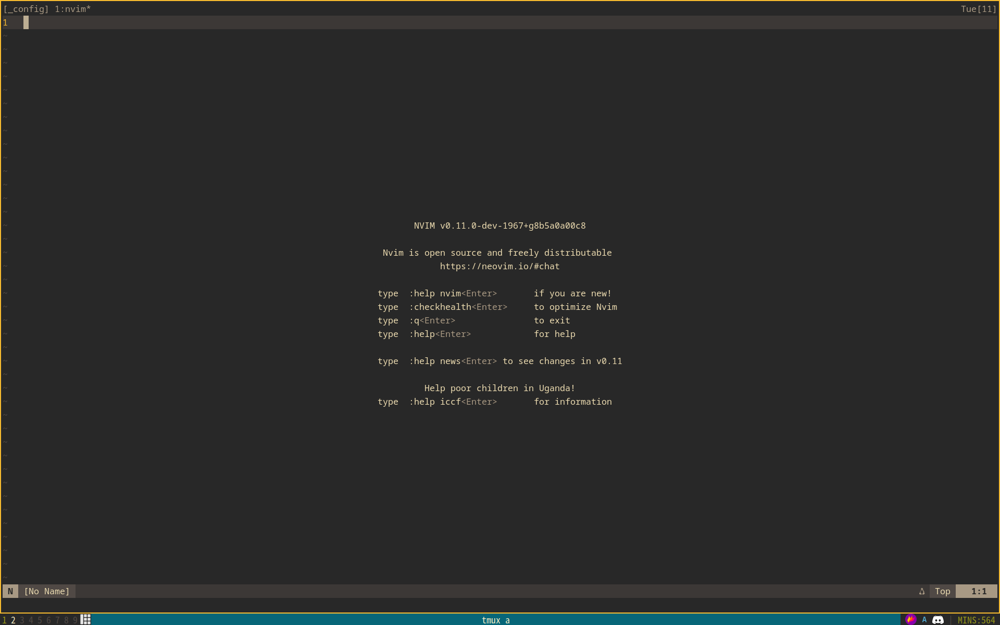
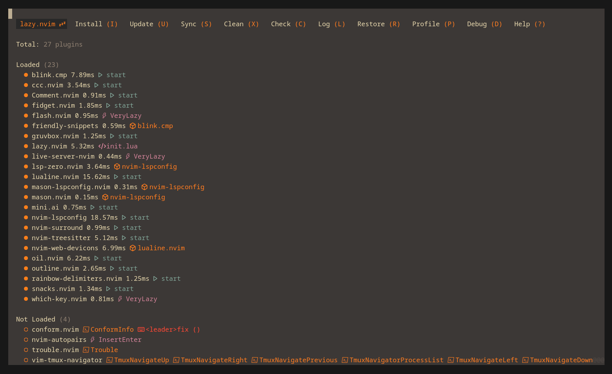

# NVIM CONFIG
1. [Explanation](#explanation)
2. [Base configuration files](#base)
3. [Plugin configuration files](#plugins)
4. [Screenshots](#screenshots)

## Explanation 
- All of my configuration stuff is done inside of ``~/.config/nvim/lua/lucas``.
- I make sure to keep the amount of plugins I use to the minimal due to me having slow SSDs.
- This might not work on your system, but it works on mine so that's all what matters
- I compile [Neovim](https://www.github.com/neovim/neovim) from source, though I don't think it makes much of a difference for this

## Base configuration files 
- [autocmd](https://github.com/tokisuno/dotfiles/blob/main/.config/nvim/lua/lucas/autocmd.lua)
- [globals](https://github.com/tokisuno/dotfiles/blob/main/.config/nvim/lua/lucas/globals.lua)
- [lazy-config](https://github.com/tokisuno/dotfiles/blob/main/.config/nvim/lua/lucas/lazy.lua)
- [opts](https://github.com/tokisuno/dotfiles/blob/main/.config/nvim/lua/lucas/opts.lua)
- [remaps](https://github.com/tokisuno/dotfiles/blob/main/.config/nvim/lua/lucas/remap.lua)

## Plugin configuration files 
- [nvim-autopairs](https://github.com/tokisuno/dotfiles/blob/main/.config/nvim/lua/lucas/plugins/autopairs.lua)
- [blink.cmp](https://github.com/tokisuno/dotfiles/blob/main/.config/nvim/lua/lucas/plugins/blink.lua)
- [ccc.vim](https://github.com/tokisuno/dotfiles/blob/main/.config/nvim/lua/lucas/plugins/ccc.lua)
- [commenting](https://github.com/tokisuno/dotfiles/blob/main/.config/nvim/lua/lucas/plugins/comments.lua)
- [conform](https://github.com/tokisuno/dotfiles/blob/main/.config/nvim/lua/lucas/plugins/conform.lua)
- [fidget](https://github.com/tokisuno/dotfiles/blob/main/.config/nvim/lua/lucas/plugins/fidget.lua)
- [flash](https://github.com/tokisuno/dotfiles/blob/main/.config/nvim/lua/lucas/plugins/flash.lua)
- [gruvbox](https://github.com/tokisuno/dotfiles/blob/main/.config/nvim/lua/lucas/plugins/gruvbox.lua)
- [lsp-config, lsp-zero, mason, and mason-lspconfig](https://github.com/tokisuno/dotfiles/blob/main/.config/nvim/lua/lucas/plugins/lsp.lua)
- [lualine](https://github.com/tokisuno/dotfiles/blob/main/.config/nvim/lua/lucas/plugins/lualine.lua)
- [mini.nvim](https://github.com/tokisuno/dotfiles/blob/main/.config/nvim/lua/lucas/plugins/mini.lua)
- [oil](https://github.com/tokisuno/dotfiles/blob/main/.config/nvim/lua/lucas/plugins/oil.lua)
- [outline](https://github.com/tokisuno/dotfiles/blob/main/.config/nvim/lua/lucas/plugins/outline.lua)
- [raindow-delimiters](https://github.com/tokisuno/dotfiles/blob/main/.config/nvim/lua/lucas/plugins/raindow-delimiters.lua)
- [folke's snacks](https://github.com/tokisuno/dotfiles/blob/main/.config/nvim/lua/lucas/plugins/snacks.lua)
- [nvim-surround](https://github.com/tokisuno/dotfiles/blob/main/.config/nvim/lua/lucas/plugins/surround.lua)
- [vim-tmux-navigator](https://github.com/tokisuno/dotfiles/blob/main/.config/nvim/lua/lucas/plugins/tmux.lua)
- [treesitter](https://github.com/tokisuno/dotfiles/blob/main/.config/nvim/lua/lucas/plugins/treesitter.lua)
- [trouble](https://github.com/tokisuno/dotfiles/blob/main/.config/nvim/lua/lucas/plugins/trouble.lua)
- [live-server-nvim](https://github.com/tokisuno/dotfiles/blob/main/.config/nvim/lua/lucas/plugins/web.lua)
- [whichkey.lua](https://github.com/tokisuno/dotfiles/blob/main/.config/nvim/lua/lucas/plugins/whichkey.lua)

## Screenshots 
### Start Screen

### Plugins List

